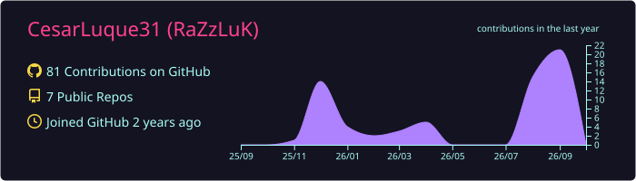
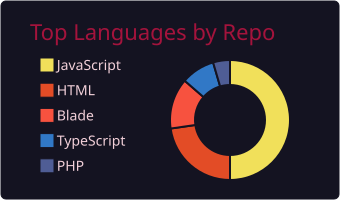
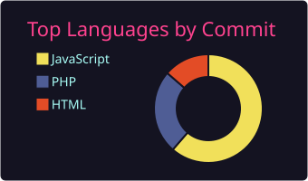
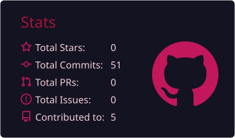
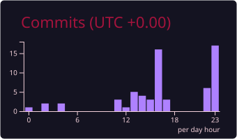

<div align="center">


<br/>

[](https://x.com/RaZz_LuK)
[](https://discord.com/users/razzluk)
[](https://www.twitch.tv/razzluk)
[](mailto:rasecluk@gmail.com)

</div>

<br/>

<table>
<tr>
<td width="190" valign="middle">

</td>
<td valign="middle">

```diff
  🛠️ Ingeniero de Sistemas.
+ 🎨 Frontend, ⚙️ Backend y 🗄️ Bases de datos.
# 📱 Apps web y móviles, de la idea al deploy.
- 🤖 Automatizaciones, integraciones y APIs a la medida.
+ 📊 Dashboards que convierten datos en decisiones.
! 🧠 Soluciones con IA para problemas del mundo real.
@@ 🚀 Construyo lo que otros describen. @@
```

</td>
<td width="190" valign="middle" align="center">

</td>
</tr>
</table>

<div align="center">

</div>

## 🛠️ Tecnologías

**Lenguajes**


**Frontend**


**Backend**


**Bases de Datos y Servicios Cloud**


**Desarrollo Móvil**


**Automatización, Datos e Integraciones**


**Herramientas, DevOps y Diseño**


<div align="center">

</div>

## 🎯 Áreas & Enfoque

<table>
<tr>
<th align="left">Área</th>
<th align="left">Nivel</th>
<th align="left">Stack principal</th>
</tr>
<tr>
<td>🎨 <b>Frontend</b></td>
<td></td>
<td>


</td>
</tr>
<tr>
<td>⚙️ <b>Backend</b></td>
<td></td>
<td>


</td>
</tr>
<tr>
<td>🗄️ <b>Bases de datos</b></td>
<td></td>
<td>


</td>
</tr>
<tr>
<td>🤖 <b>Automatización</b></td>
<td></td>
<td>


</td>
</tr>
<tr>
<td>📱 <b>Móvil</b></td>
<td></td>
<td>


</td>
</tr>
</table>

## 📊 Estadísticas

<div align="center">









</div>

<br/>

<div align="center">

<a href="mailto:rasecluk@gmail.com">
  
</a>
</div>


